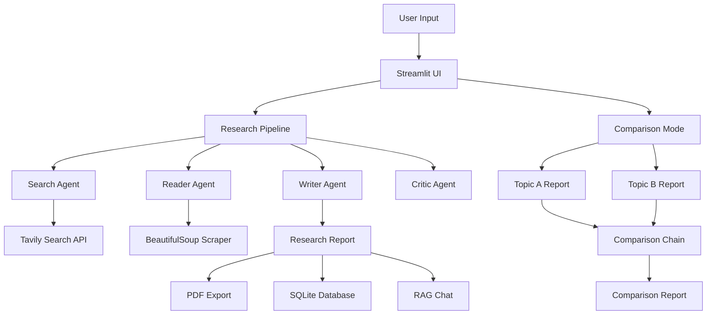

# 🚀 Multi-Agent AI Research Platform

An intelligent AI-powered research assistant built using **LangChain**, **Streamlit**, and multiple Large Language Models (**Mistral, Gemini, and OpenAI**).

The platform uses a multi-agent architecture to autonomously research topics, gather information from the web, generate detailed reports, compare topics, evaluate report quality, chat with generated reports using Retrieval-Augmented Generation (RAG), and export results as PDF documents.

---

## ✨ Features

### 🤖 Multi-Agent Research Pipeline

* Search Agent
* Reader Agent
* Writer Agent
* Critic Agent

### 🔍 Intelligent Web Research

* Tavily Search API Integration
* BeautifulSoup Web Scraping
* Real-time information gathering

### 📚 Retrieval-Augmented Generation (RAG)

* FAISS Vector Store
* Document Chunking
* Embedding-Based Retrieval
* Conversational Q&A with Generated Reports

### ⚖️ Topic Comparison

* Compare two research topics
* Generate structured comparison reports
* Similarities and differences analysis
* Comparative recommendations

### 🧠 Multi-LLM Support

* Mistral AI
* Google Gemini
* OpenAI

### 📄 Report Export

* Professional PDF Generation
* Download Research Reports
* Download Comparison Reports

### 💾 Research History

* SQLite Database Storage
* Persistent Research Records
* Search Previous Reports
* Delete Reports

### 🎨 Interactive UI

* Streamlit Frontend
* Research Mode
* Comparison Mode
* Dashboard View

---

## 🏗️ Architecture



---

## 🔄 Workflow

### Research Mode

1. User enters a topic
2. Search Agent gathers information from the web
3. Reader Agent extracts detailed content
4. Writer Agent creates a structured report
5. Critic Agent evaluates report quality
6. Report is stored in SQLite
7. PDF is generated
8. Report is indexed for RAG chat

### Comparison Mode

1. User enters two topics
2. Independent research reports are generated
3. Comparison Chain analyzes both reports
4. Similarities and differences are identified
5. Structured comparison report is generated

---

## 🛠️ Tech Stack

### AI & GenAI

* LangChain
* LangGraph
* Mistral AI
* Google Gemini
* OpenAI

### Retrieval-Augmented Generation

* FAISS
* HuggingFace Embeddings

### Search & Scraping

* Tavily Search API
* BeautifulSoup

### Backend

* Python

### Frontend

* Streamlit

### Database

* SQLite

### Utilities

* ReportLab
* Python Dotenv

---

## 🚀 Installation

### Clone Repository

```bash
git clone https://github.com/YOUR_USERNAME/ResearchReport_AI_AGENT.git

cd ResearchReport_AI_AGENT
```

### Create Virtual Environment

```bash
python -m venv myenv
```

### Activate Virtual Environment

Windows:

```bash
myenv\Scripts\activate
```

Linux / Mac:

```bash
source myenv/bin/activate
```

### Install Dependencies

```bash
pip install -r requirements.txt
```

### Configure Environment Variables

Create a `.env` file in the root directory.

```env
MISTRAL_API_KEY=your_mistral_api_key

GOOGLE_API_KEY=your_google_api_key

OPENAI_API_KEY=your_openai_api_key

TAVILY_API_KEY=your_tavily_api_key
```

### Run Application

```bash
streamlit run app.py
```

---

## 📸 Screenshots

### Research Mode

*Add screenshot here*

### Comparison Mode

*Add screenshot here*

### RAG Chat

*Add screenshot here*

### Research History

*Add screenshot here*

---

## 🎯 Future Improvements

* DOCX Export
* Research Analytics Dashboard
* LangSmith Integration
* Citation Generation (APA / IEEE / MLA)
* Research Mind Maps
* Cloud Deployment

---

## 📂 Project Structure

```text
ResearchReport_AI_AGENT/

├── database/
├── llms/
├── ragConcepts/
├── utils/

├── agents.py
├── agentTools.py
├── app.py
├── comparison.py
├── comparisonChain.py
├── comparisonPrompt.py
├── final_pipeline.py
├── requirements.txt
├── README.md
```

---

## 👨‍💻 Author

**Anant Singh**

B.Tech CSE 

USICT, GGSIPU

### Interests

* Generative AI
* Agentic AI
* Machine Learning
* Backend Development

---

## ⭐ If you found this project useful

Consider giving it a star on GitHub.
